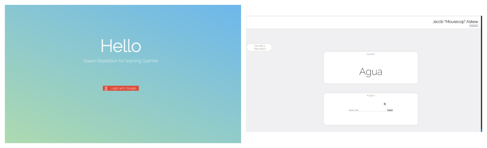
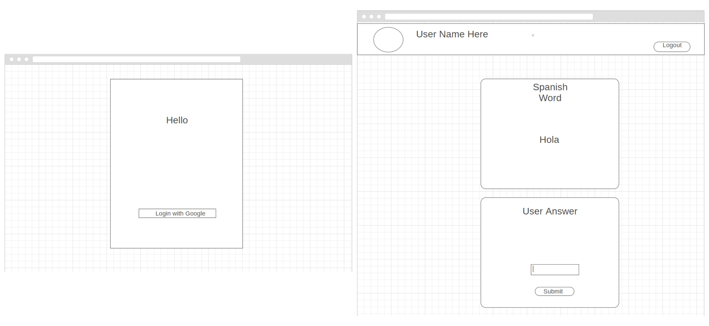

<h1>Space Repetiton Project</h1>
<p><a href="https://cryptic-gorge-39969.herokuapp.com/">Space Repition Project</a> is a full-stack app that helps users learn the beautiful language of spanish using the Space Reptetion algorithm.</p>




## Getting started


### Installing project locally

```
> git clone https://github.com/simgill13/spaced-repetition-algorithm-app-.git 

> cd spaced-repetition-algorithm-app-

> npm install 
```

### Launching 
```
> npm run dev
```
Then open [http://localhost:8080](http://localhost:8080) in a browser.

<h2>Introduction</h2>
<p>The main focus of the Spanish Repetiton Project was to help people learn one of the most popular and beautiful languages on the planet. By using the <a href="https://en.wikipedia.org/wiki/Spaced_repetition">Space Repetiton</a> technique to teach Spanish, users are able to learn at a much more efficient pace.</p>

<h2>How it works</h2>
<h3>Sign into Google</h3>
<p>Whether you are looking to pick up useful new skill or to impress a special person, Spanish Repetition is going to help you get the results you are seeking. By asking questions in an intuitive way, users will see questions that they get wrong more frequently than questions they get right. This way you can focus on learning what you don't know and not what you already do know.</p>

<h2>Wire Frames</h2>
<p>All wire frames were made with <a href="https://wireframe.cc/hcUHVo">Wireframe.cc</a>.</p>


<h2>Technologies</h2>
<h3>Front-End</h3>
<ul>
    <li>HTML</li>
    <li>CSS</li>
    <li>Javascript</li>
    <li>React / React-Router</li>
    <li>Redux / Redux-Thunk</li>
    <li>React-Redux</li>
    <li>Jquery</li>
    <li><a href="https://github.com/js-cookie/js-cookie">JS-Cookie</a> to send a cookie to keep users logged in after app is closed.</li>
</ul>
<h3>Back-End</h3>
<ul>
    <li>Node.js + Express.js (web server)</li>
    <li>MongoDB + Mongoose</li>
    <li><a href="https://mlab.com/welcome/">mlab</a> for cloud database</li>
</ul>

<h3>Security</h3>
<ul>
    <li>Users login using GitHub's <a href="https://developer.github.com/v3/oauth/">OAuth2</a> to keep content secure</li>
    <li><a href="http://passportjs.org/">Passport</a> is use to validate users with Google, and also control non-authorized users to certain endpoints.</li>
</ul>
